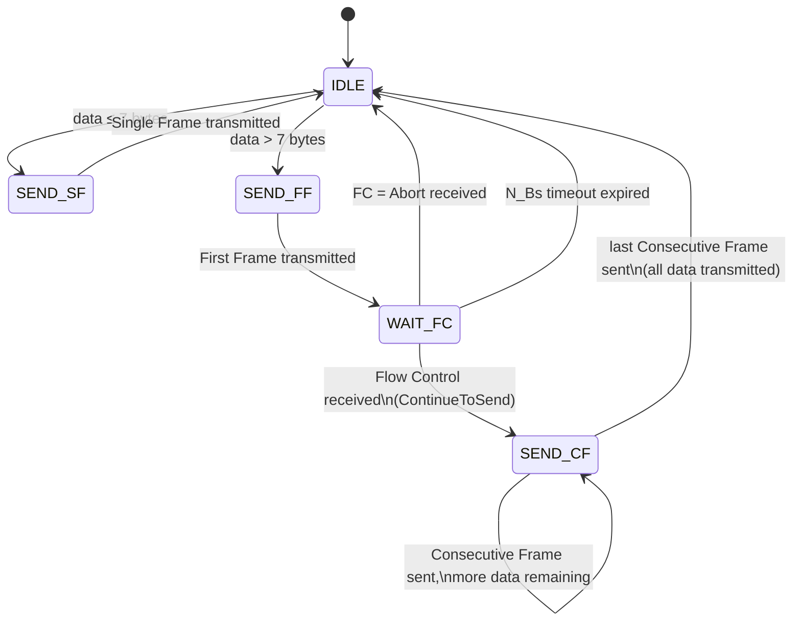
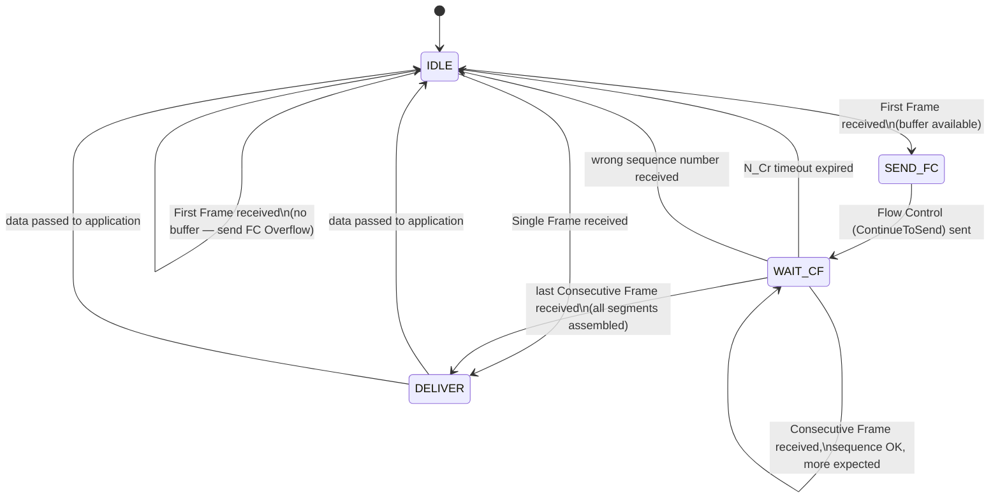

# AURIX TC2x Learning Projects

A hands-on learning repository for the **Infineon AURIX TC2x** microcontroller family (specifically the **TC29B**), using the Infineon Low Level Drivers (iLLD) library.

---

## Hardware

| Item | Details |
|---|---|
| MCU | Infineon AURIX TC29B (TriCore architecture) |
| Target Board | TriBoard TC2X7 V1.0 |
| User LEDs | 8 × active-low LEDs on PORT 33, pins 6–13 (active-low) |
| Crystal | 20 MHz external oscillator |
| CPU/STM Clock | 200 MHz (configured via PLL) |

---

## Projects

### Test2 — LED Blink (Multicore)

A bare-metal multicore blink example that exercises the three on-chip TriCore CPUs.

**What it does**

| Pin range | Role |
|---|---|
| P33.6 – P33.10 | 5 × hardware PWM via GTM/TOM0-CH2,3,4,1,0 — phased sawtooth wave |
| P33.11 – P33.13 | 3-bit binary counter driven from STM ISR, steps every 100 ms |

- **CPU0** initialises all five GTM TOM channels (1 kHz, active-low), runs an STM ISR every 5 ms that advances every channel's duty by ~1% and updates the 3-bit counter, and orchestrates the inter-core mailbox.
- **CPU1 / CPU2** perform watchdog disable and participate in the CPU synchronisation barrier, then idle in their main loops.
- All cores synchronise at startup via `IfxCpu_syncEvent` before entering their main loops.

**Multi-CPU process**

All three cores start in parallel. Each calls `IfxCpu_emitEvent` then `IfxCpu_waitEvent` on a shared `cpuSyncEvent` flag, so no core enters its main loop until all three have reached the barrier.

After sync, the cores split work via a shared mailbox (`Mailbox g_mbCpus`) placed in non-cached LMU RAM:

| Core | Role |
|---|---|
| CPU0 | Posts requests, drives LEDs & GTM PWM, reads results |
| CPU1 | Worker — computes `inputA²` and signals `MB_DONE` |
| CPU2 | Worker — computes `inputA + inputB` and signals `MB_DONE` |

CPU0 writes inputs, sets `cmd = MB_REQ`, then polls until the worker sets `cmd = MB_DONE`. No cache-flush is needed because LMU is non-cached on TC29x.

**Key concepts demonstrated**

- Multicore startup and CPU synchronisation (`IfxCpu_syncEvent`)
- Inter-core mailbox over non-cached LMU RAM (`SharedMem.h`)
- Watchdog disable (CPU + Safety watchdog)
- GPIO output configuration and toggling via iLLD (`IfxPort_*`)
- GTM/TOM multi-channel hardware PWM with table-driven init and phase-staggered sawtooth wave
- Shadow register (`SR1`) update from ISR for glitch-free duty changes at 1 kHz
- TGC (TOM Global Channel) used to enable all channels atomically
- Periodic STM ISR for multi-channel PWM duty stepping and 3-bit LED counter
- PLL / clock configuration (`Ifx_Cfg.h`)
- Spinlock-based mutual exclusion (`SpinBox` in `SharedMem.h`) vs. plain volatile flag (`Mailbox`)

---

## Memory Layout — Why Shared Variables Are Globals, Not Stack or Heap

This is one of the most important differences between embedded bare-metal C and desktop/application C.

### The three memory regions

| Region | Where | Lifetime | Who owns it |
|---|---|---|---|
| **Static / global** | BSS / data segment, placed by linker | Entire program | Compiler + linker |
| **Stack** | Per-core DSPR, grows downward from a fixed top | Duration of the enclosing function call | CPU stack pointer |
| **Heap** | A linker-reserved pool; `malloc` / `new` carve from it | Until `free` / `delete` | Programmer |

### Why `Mailbox` and `SpinBox` must be globals

**1. They must outlive every function.**
Both structs are used across all three cores for the entire runtime. If either were a local variable inside `core0_main`, its memory would belong to CPU0's stack frame. The moment `core0_main` returned (it never does, but hypothetically), that memory would be reclaimed. CPU1 and CPU2 would then be reading garbage.

**2. They must be in a specific, known memory region.**  
On TC29x, inter-core shared data must sit in **non-cached memory** (DSPR scratchpad or LMU). All three TriCore CPUs share the global address bus and can reach DSPR/LMU without cache coherency concerns. If a variable ends up in a cached region, one core's write will sit in its private cache line and the other cores will read the old value from RAM — a silent data corruption that is nearly impossible to debug.

Global variables in this project land in DSPR by default (the linker script places `.bss` / `.data` there). The linker decides the exact address at build time, so the placement is guaranteed and reproducible.

**3. The stack is private to each core.**
Every TriCore CPU has its own stack in its own DSPR bank. CPU0's stack is invisible to CPU1 and CPU2. Placing a shared struct on CPU0's stack and passing its address to CPU1 would require CPU1 to reach across the global bus into CPU0's DSPR — possible, but the address is dynamic (depends on the call depth at runtime), non-cached only by coincidence, and will crash if CPU0's stack ever grows past that point.

### Why `malloc` / `new` must be avoided in bare-metal embedded

| Problem | Consequence on bare metal |
|---|---|
| **Non-deterministic timing** | `malloc` may take a variable number of cycles depending on heap fragmentation. Safety standards (ISO 26262, AUTOSAR) prohibit this in time-critical code. |
| **No memory protection** | There is no MMU or OS to catch a buffer overrun or a double-free. A bad `free()` silently corrupts the heap and causes a crash minutes later with no traceable cause. |
| **Tiny heap** | The linker script reserves a small heap (often 2–8 KB). Running out returns `NULL` from `malloc`; on bare metal nothing catches that and the next dereference causes a bus error or silent corruption. |
| **Cannot control placement** | `malloc` allocates from wherever the linker placed the heap. You cannot guarantee the result is in non-cached LMU, so multi-core shared objects allocated with `malloc` may silently land in a cached region. |
| **Objects that are never freed** | For permanent singleton objects like `Mailbox` and `SpinBox`, `malloc` achieves exactly the same result as a global — static lifetime, single instance — but adds runtime overhead, a failure mode (`NULL` return), and non-determinism with no benefit. |

### The rule for shared multi-core objects on AURIX

> Declare them as file-scope globals (or with an explicit linker section attribute). Let the linker place them at a fixed, known address in non-cached RAM. Never allocate them on the stack or the heap.

This is not a limitation of C — it is the correct tool for the job. The global lifetime *is* the intended lifetime, and the linker-controlled placement *is* the required placement.

---

## Ethernet / UDP (Test2 — TriBoard TC297 V1.0)

`Test2` also contains a bare-metal UDP/IP stack (`Eth_Udp.c / Eth_Udp.h`) that implements ARP reply and UDP broadcast/receive over the on-chip ETH MAC in RMII mode.

### Known Hardware Issue — PHY strap resistor R370

**Problem:** The PEF7071 Ethernet PHY on the **TriBoard TC297 V1.0** powers on in **MII mode** by default (R370 = 11 kΩ strap).  The TC29x ETH MAC is configured for **RMII mode**, so the two interfaces are incompatible.  In MII mode the PHY does not generate the 50 MHz REFCLK that RMII requires, so no frames are ever transmitted or received.

Symptoms observed during debugging:
- Green link LED on the RJ45 connector (physical layer OK)
- `ETH_TX_FRAME_COUNT_GOOD` (MAC hardware counter) stays at 0 or 1 — TX FIFO fills and stalls
- `ETH_RX_FRAMES_COUNT_GOOD_BAD` stays at 0 — MAC receives nothing
- Wireshark shows no packets from 192.168.1.200
- `ping 192.168.1.200` gets "Destination host unreachable" (no ARP reply from board)

**Root cause:**  
The TriBoard uses R370 = 11 kΩ as a MODE strap pin on the PEF7071.  This selects a non-RMII interface mode at power-on.  The Application Kit TC2x7 V1.1 uses a different strap value and powers on in RMII mode automatically.  MDIO software configuration of `MIICTRL` register (0x17 ← 0xF702) is required to switch the TriBoard PHY to RMII mode, but this is hampered by the fact that P21.1 (MDIO) **alt6** does not map to the ETH MAC's MDO output on this TC29x silicon, making GMII-hardware MDIO writes unreliable.

**Fix — change resistor R370 (recommended hardware fix):**

> Replace **R370** on the TriBoard TC297 V1.0 from **11 kΩ → 3.3 kΩ** (same SMD package, e.g. 0402).

With R370 = 3.3 kΩ the PEF7071 powers on in the same RMII-compatible mode as the Application Kit.  No MDIO writes are needed; the ETH MAC and PHY interface match immediately and Ethernet works without any software change.

*(Reference: Infineon community thread #317565, reply by Infineon employee "MoD", August 2020.)*

### Additional iLLD bugs fixed in this project

The following bugs were found in `iLLD_1_20_0` for TC29B and are patched in this repository:

| File | Bug | Fix |
|---|---|---|
| `IfxEth.c` `IfxEth_setupRmiiOutputPins` | MDIO pad driver and output never configured for P21.1 (TriBoard MDIO pin) | Added `setPinPadDriver` + `setPinModeOutput` for `pinIndex == 1` |
| `IfxEth.c` `IfxEth_init` | `IfxEth_resetModule()` (kernel reset) wipes `ETH_GPCTL.ALTI` input-mux registers; RMII input pins (REFCLK, CRS_DV, RXD0, RXD1, MDIO) lose their routing after reset | Re-call `IfxEth_setupRmiiInputPins` after `resetModule()` |
| `Eth_Udp.c` `phyInitSafe` | PHY reset read-back loop exits instantly because MDIO reads return 0 — `MIICTRL` write arrives while PHY is still in reset and is dropped | Replace read-back loop with a 100 ms hard delay (`IfxStm_waitTicks`) |

### Network configuration

| Setting | Value |
|---|---|
| Board IP | 192.168.1.200 |
| Board MAC | 00:11:22:33:44:55 |
| UDP log port (TX) | 4001 (broadcast every 500 ms) |
| UDP command port (RX) | 4000 |

**PC-side tools:**
```
# Listen for board log packets
ncat -u -l 4001

# Send commands to board
ncat -u 192.168.1.200 4000
```

**Wireshark display filter:**
```
ip.src == 192.168.1.200
```

---

## Test2 — DTS (Die Temperature Sensor)

The TC29x has a dedicated **Die Temperature Sensor (DTS)** wired directly to the SCU — no external hardware required.  It is completely separate from the VADC; it has its own start/result/busy registers inside `MODULE_SCU`.

### What it does in this project

The DTS raw reading (a 10-bit value) is mapped linearly to the **GTM PWM duty-step size**, so the five-LED sawtooth wave speeds up when the die is hot and slows down when it is cold.  Two debugger watch variables expose the result:

| Variable | Description |
|---|---|
| `g_tempRaw` | Raw 10-bit DTS RESULT field (0–1023) |
| `g_tempDegC` | Integer °C derived from raw value |
| `g_dutyStep` | Duty increment per 5 ms STM tick (higher = faster wave) |

### Key DTS facts

| Item | Value |
|---|---|
| Resolution | 10-bit (0–1023) |
| Conversion time | ≤ 100 µs |
| Calibration formula | `temp_°C = raw × 0.467 − 285.5` |
| First two results | Must be discarded (sensor warm-up) |
| iLLD header | `Dts/Dts/IfxDts_Dts.h` |

### Duty-step mapping

$$\text{step} = 16 + \frac{T_{°C} \times 234}{100} \quad \text{clamped to } [16,\ 1000]$$

| Temperature | Duty step | Effect |
|---|---|---|
| 0 °C | 16 | Very slow wave |
| 25 °C | ~74 | Near-default speed |
| 50 °C | ~133 | Twice normal speed |
| 80 °C | ~203 | Three times normal speed |

### Key concepts demonstrated

- DTS initialisation via `IfxDts_Dts_initModule` / `IfxDts_Dts_startSensor`
- Polling `IfxDts_Dts_isBusy` for conversion completion (≤ 100 µs)
- Integer-only temperature calculation from raw register value
- Using a `volatile` shared variable as a live parameter between the main loop and an ISR on the same core
- Sensor warm-up: first two readings discarded per iLLD documentation

---

## Test2 — CAN Temperature Transmission (MULTICAN)

The TC29B integrates a **MULTICAN** controller with two independent CAN modules (CAN0: 4 nodes, CAN1/CANR: 2 nodes).  This project uses **CAN0 Node 0** to broadcast the die temperature over a standard CAN bus at 500 kBaud every **500 ms**.

### What it does

Once per 500 ms tick (the same tick that reads the DTS), CPU0 packs the latest temperature values into a 4-byte CAN frame and transmits it non-blocking on CAN0 Node 0.

### CAN frame

| Field | Value |
|---|---|
| CAN ID | `0x700` (standard 11-bit) |
| DLC | 8 bytes |
| `data[0]` (bytes 0–3) | `g_tempDegC` — signed integer °C |
| `data[1]` (bytes 4–7) | `0x54656D70` — ASCII label **`"Temp"`** (T e m p) |

### Hardware

| Item | Value |
|---|---|
| Module | CAN0 (`MODULE_CAN`) |
| Node | Node 0 |
| Baud rate | 500 kBaud |
| TX pin | P20.8 (`IfxMultican_TXD0_P20_8_OUT`) |
| RX pin | P20.7 (`IfxMultican_RXD0B_P20_7_IN`) |

> A CAN transceiver (e.g. TJA1050 or equivalent) must be connected between P20.8 / P20.7 and the bus differential pair (CANH / CANL).

### Key concepts demonstrated

- MULTICAN module and node initialisation via `IfxMultican_Can_initModule` / `IfxMultican_Can_Node_init`
- Transmit message object configuration (`IfxMultican_Can_MsgObj_init`)
- Non-blocking periodic CAN frame transmission with `IfxMultican_Can_MsgObj_sendMessage`
- Packing two related values (`sint16` °C + `uint16` raw ADC) into the 4-byte CAN payload

---

## Sending More Than 8 Bytes Over CAN (Future Reference)

Classic CAN is limited to **8 bytes per frame**.  When a payload — such as a descriptive string — is longer than 8 bytes, three strategies are available:

### Option 1 — Abbreviate (simplest)
Shorten the label so it fits alongside the value in one 8-byte frame.  
Example: `data[0]` = temperature °C, `data[1]` = `"TmpCPU "` (7 ASCII chars + null).  
**Use when:** the receiver is a simple CAN logger or oscilloscope and no extra protocol overhead is acceptable.

### Option 2 — Custom multi-frame
Split the payload across consecutive CAN frames.  Reserve byte 0 of each frame as a sequence counter; bytes 1–7 carry data.

```
Frame 1:  [0x01]["Tempera"]
Frame 2:  [0x02]["ture of"]
Frame 3:  [0x03][" the CP"]
Frame 4:  [0x04]["U every"]
Frame 5:  [0x05][" 500 ms"]
```

No handshake — the sender fires all frames back-to-back and the receiver reassembles them by sequence number.  
**Use when:** both sender and receiver are custom code you control and you want minimal complexity.

### Option 3 — ISO 15765-2 (CAN Transport Protocol)

> **Standard:** ISO 15765-2:2016 — *Road vehicles — Diagnostic communication over Controller Area Network (DoCAN) — Part 2: Transport protocol and network layer services*  
> **Published by:** International Organization for Standardization (ISO)  
> **Related standards:** ISO 15765-1 (general), ISO 15765-3 (implementation), ISO 14229 (UDS — built on top of this layer)

The **automotive standard** for multi-frame CAN messages.  Used by OBD-II, UDS (ISO 14229), and all modern ECU diagnostics.  Supported natively by tools such as CANalyzer, PCAN-View, and any UDS tester.

#### Frame types

| Type | Byte 0 | Purpose |
|---|---|---|
| Single Frame (SF) | `0x0N` (N = length) | Payload ≤ 7 bytes — sent as one frame |
| First Frame (FF) | `0x1H 0xLL` (12-bit total length) | Starts a long message, carries first 6 bytes |
| Consecutive Frame (CF) | `0x2N` (N = sequence 1–F) | Carries next 7 bytes; sequence wraps 1→F→1 |
| Flow Control (FC) | `0x30` | Sent **by the receiver** — grants permission to continue |

#### Transmission sequence for `"Temperature of the CPU every 500 millisecond"` (44 bytes)

```
Sender (TC29B)                              Receiver (PC / ECU)
────────────────────────────────────────────────────────────────
First Frame    →  10 2C | 54 65 6D 70 65 72    ("Temper")
                                           ←   Flow Control: 30 00 00 CC CC CC CC CC
Consecutive 1  →  21 | 61 74 75 72 65 20 6F    ("ature o")
Consecutive 2  →  22 | 66 20 74 68 65 20 43    ("f the C")
Consecutive 3  →  23 | 50 55 20 65 76 65 72    ("PU ever")
Consecutive 4  →  24 | 79 20 35 30 30 20 6D    ("y 500 m")
Consecutive 5  →  25 | 69 6C 6C 69 73 65 63    ("illisec")
Consecutive 6  →  26 | 6F 6E 64 CC CC CC CC    ("ond" + 4 padding bytes)
```

#### Byte-level breakdown — every frame on the bus

| Frame | Dir | B0 | B1 | B2 | B3 | B4 | B5 | B6 | B7 |
|---|---|---|---|---|---|---|---|---|---|
| First Frame | Sender → | `10` PCI hi | `2C` len=44 | `54` **T** | `65` **e** | `6D` **m** | `70` **p** | `65` **e** | `72` **r** |
| Flow Control | ← Receiver | `30` CTS | `00` BS=0 | `00` STmin | `CC` pad | `CC` pad | `CC` pad | `CC` pad | `CC` pad |
| CF seq=1 | Sender → | `21` | `61` **a** | `74` **t** | `75` **u** | `72` **r** | `65` **e** | `20` **·** | `6F` **o** |
| CF seq=2 | Sender → | `22` | `66` **f** | `20` **·** | `74` **t** | `68` **h** | `65` **e** | `20` **·** | `43` **C** |
| CF seq=3 | Sender → | `23` | `50` **P** | `55` **U** | `20` **·** | `65` **e** | `76` **v** | `65` **e** | `72` **r** |
| CF seq=4 | Sender → | `24` | `79` **y** | `20` **·** | `35` **5** | `30` **0** | `30` **0** | `20` **·** | `6D` **m** |
| CF seq=5 | Sender → | `25` | `69` **i** | `6C` **l** | `6C` **l** | `69` **i** | `73` **s** | `65` **e** | `63` **c** |
| CF seq=6 | Sender → | `26` | `6F` **o** | `6E` **n** | `64` **d** | `CC` pad | `CC` pad | `CC` pad | `CC` pad |

**Key:**  `·` = space character (0x20) · `pad` = `0xCC` fill (ISO 15765-2 padding convention) · `CTS` = Continue To Send · `BS` = Block Size · `STmin` = Separation Time minimum

**Total frames on bus: 8** (6 sender + 1 FC from receiver, excluding the First Frame acknowledgement implied by FC)

#### Important: the receiver must participate
The sender **pauses after the First Frame** and waits for the Flow Control frame before sending Consecutive Frames.  The receiver must implement the ISO 15765-2 state machine (or use a tool that does it automatically).

#### Sender state machine



#### Receiver state machine



#### State and timer glossary

| Symbol | Meaning |
|---|---|
| `N_Bs` | Sender timeout waiting for Flow Control (typ. 1000 ms) |
| `N_Cr` | Receiver timeout waiting for next Consecutive Frame (typ. 1000 ms) |
| `BlockSize` | How many Consecutive Frames the receiver accepts before requiring another FC (0 = send all) |
| `SeparationTime (STmin)` | Minimum gap the sender must leave between Consecutive Frames (0–127 ms, or 100–900 µs) |

**Use when:** the receiver is a UDS tester, CANalyzer, or any automotive diagnostic tool — or when you are building a system that must interoperate with standard automotive equipment.

### Comparison

| | Option 1 | Option 2 | Option 3 |
|---|---|---|---|
| Max payload | 7 bytes | Unlimited | Unlimited |
| Receiver requirement | Any CAN tool | Custom parser | ISO 15765-2 stack |
| Tool support | All | Custom only | All automotive tools |
| Complexity | None | Low | Medium |
| Best for | Simple telemetry | Internal/proprietary | Automotive / UDS / OBD |

> **TC29B limitation:** CAN FD (up to 64 bytes per frame) is **not supported** — it is only available on the 2nd-generation AURIX TC3xx.  All three options above work within the classic CAN 8-byte limit.

---

## Repository Structure

```
Tc2x/
└── Test2/                      # Project sources
    ├── Cpu0_Main.c             # Core 0 entry point – LED blink logic
    ├── Cpu1_Main.c             # Core 1 entry point – idle
    ├── Cpu2_Main.c             # Core 2 entry point – idle
    ├── Configurations/
    │   └── Ifx_Cfg.h           # Clock / PLL configuration (20 MHz XTAL, 200 MHz PLL)
    ├── Libraries/
    │   ├── iLLD/TC29B/         # Infineon Low Level Drivers (iLLD)
    │   ├── Infra/              # Platform infrastructure (compiler abstraction, SFR headers)
    │   └── Service/            # Service layer (StdIf, BSP, Math utilities)
    ├── TriCore Debug (GCC)/    # GCC build output
    ├── TriCore Debug (TASKING)/# TASKING build output
    ├── Lcf_Gnuc_Tricore_Tc.lsl     # GCC linker script
    ├── Lcf_Tasking_Tricore_Tc.lsl  # TASKING linker script
    └── winIDEA/                # iSYSTEM winIDEA debug workspace
```

---

## Toolchains

Two compiler toolchains are supported and both have pre-configured launch files:

| Toolchain | Launch file |
|---|---|
| GCC (TriCore) | `test2 TriCore Debug (GCC).launch` |
| TASKING VX-toolset | `test2 TriCore Debug (TASKING)_1.launch` |

Build artefacts (object files, map files, makefiles) are generated under the matching `TriCore Debug (GCC)/` or `TriCore Debug (TASKING)/` folders.

---

## Getting Started

1. **Clone / open** the workspace in your IDE (Eclipse-based AURIX Development Studio or TASKING Eclipse).
2. **Select a build configuration** — `TriCore Debug (GCC)` or `TriCore Debug (TASKING)`.
3. **Build** the project (`Project → Build`).
4. **Flash & debug** using the matching `.launch` configuration or the winIDEA workspace (`winIDEA/workspace.xjrf`).
5. Observe the 8 user LEDs on PORT 33 toggling on the TriBoard TC2X7.

---

## Clock Configuration (`Ifx_Cfg.h`)

| Parameter | Value |
|---|---|
| External oscillator (`XTAL`) | 20 000 000 Hz |
| PLL output frequency | 200 000 000 Hz |

These values are defined in [Test2/Configurations/Ifx_Cfg.h](Test2/Configurations/Ifx_Cfg.h) and consumed by the SCU/PLL driver at startup.

---

## Dependencies

- **iLLD** (Infineon Low Level Drivers) for TC29B — bundled under `Libraries/iLLD/`
- **Infineon SFR headers** for TC29B — bundled under `Libraries/Infra/Sfr/TC29B/`
- **AURIX Development Studio** (Eclipse + GCC) *or* **TASKING VX-toolset** for TriCore

---

## License

Source files carry the **Boost Software License 1.0** as distributed by Infineon Technologies AG.  
See the file headers for the full license text.
